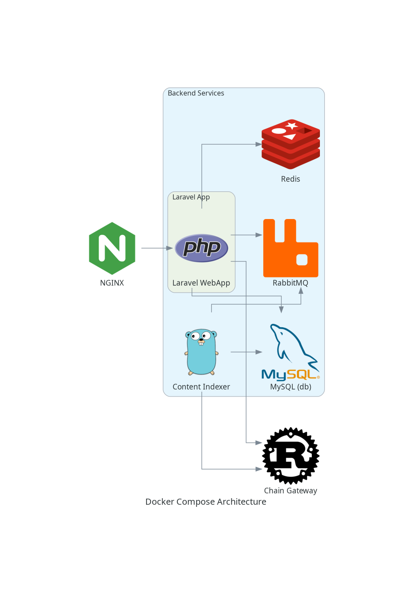

# infrastructure

This repository contains docker configuration for running projects locally

## Setup
- Install Docker Desktop
- Install Docker Compose

- Pull projects into the `proofchronicle` directory
- Create a `.env` file in the root of the repository by copying the `.env.example` file
- Update the `.env` file with the correct values
- Run `docker-compose up -d` to start the containers

- Run `make add-local-hosts` to add the local hosts to your `/etc/hosts` file 